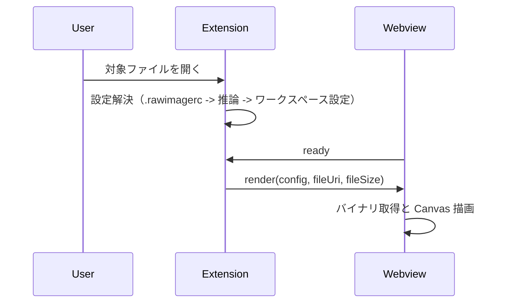

# 詳細設計書: Raw Image Viewer

## 1. 目的と位置づけ

本書は Raw Image Viewer の詳細設計を定義する。
実装に直接対応する処理フロー、メッセージ仕様、フォーマット仕様、制約、エラーハンドリングを扱う。

基本方針と責務分担は [基本設計](basic-design.md) を参照する。
将来の機能追加計画は [ロードマップ](roadmap.md) を参照する。

## 2. コア機能（現在の実装）

### 2.1 ファイル関連付け

- 対象拡張子: `.raw`, `.bin`, `.data`, `.img`, `.gray`, `.yuv`
- エクスプローラーのコンテキストメニュー Open as Raw Image で任意ファイルを表示可能

### 2.2 設定解決優先順位

レンダリングメタデータ（幅、高さ、ヘッダーサイズ、フォーマット）は以下の順で解決する。

1. `.rawimagerc`（ファイル位置から上位ディレクトリへ探索）
2. ファイル名推論（例: `name_1920x1080_rgb24.raw`）
3. ワークスペース設定（`rawviewer.defaultWidth` など）

### 2.3 サポートピクセルフォーマット

すべてのピクセルフォーマットの性質(1ピクセルあたりのバイト数、ストリーミングデコード対応可否、グレースケールストリーム対応可否、偶数幅/高さ制約、必要バイト数の計算式、説明文)は `src/formats.ts` の `rawImageFormatDescriptors`(`Record<RawImageFormat, RawImageFormatDescriptor>`)という単一テーブルに集約されている。`types.ts` の `supportedFormats` / `streamDecodableFormats` / `grayscaleStreamFormats`、`decoder.ts` のデコード処理、Webview のヘルプテーブル(設定未検出時に表示される対応フォーマット一覧)は、いずれもこのテーブルから導出される。

| カテゴリ   | フォーマット                         | Bytes/Pixel | ストリーミング  | 備考                                          |
| :--------- | :----------------------------------- | :---------- | :-------------- | :-------------------------------------------- |
| Grayscale  | `gray8`, `gray16le`, `gray16be`      | 1, 2        | ○               | 8/16-bit グレー。ウィンドウ/レベル対象        |
| RGB/BGR    | `rgb24`, `bgr24`, `rgba32`, `bgra32` | 3, 4        | ○               | インターリーブ形式                            |
| YUV        | `yuv420p`, `nv12`, `yuyv422`         | 1.5 - 2     | ×               | Planar/Semi-planar/Packed。偶数幅(・高さ)必須 |
| Scientific | `float32`, `depth16`                 | 4, 2        | × / ○ (depth16) | 自動ウィンドウ/レベル                         |

新しいピクセルフォーマットを追加する場合、`src/formats.ts` の記述子テーブルに 1 エントリを追加する(併せて `types.ts` の `RawImageFormat` 系型エイリアス、`schemas/rawimagerc.schema.json` と `package.json` の enum も更新が必要。これらの整合はテストで機械的に検証される)。詳細は [AGENTS.md](../AGENTS.md) を参照。

### 2.4 提供機能

- Canvas レンダリング
- PNG エクスポート
- `.rawimagerc` 向け JSON スキーマ連携（補完/検証）
- ズーム/パン、Fit-to-screen、ウィンドウ/レベル調整
- ピクセル位置と値の表示
- カラーマップセレクター（グレースケール系フォーマット向け: Grayscale / Jet / Viridis / Hot）

## 3. 処理フロー

### 3.1 ファイルオープン

1. カスタムエディタを起動
2. 設定解決（`.rawimagerc` → 推論 → ワークスペース設定）
3. Webview へ `render` メッセージ送信

### 3.2 初回描画

- Webview 側が `ready` を 250 ms 間隔で繰り返し送信（Extension からの acknowledgement を受け取るまで）
- Extension 側は `ready` 受信後に描画開始し、タイマーをキャンセル
- 300 ms のフォールバックタイマーにより、`ready` 未受信でも `render` を送信
- 5 秒間 `ready` を受信しない場合は警告メッセージを表示

### 3.3 再描画

- 対象ファイルや `.rawimagerc` の更新時に再解決・再描画
- 連続更新は 100 ms デバウンスして反映
- カラーマップ変更時は現在の W/L 値を維持したまま即時再描画（postMessage 不要）

### 3.4 PNG 保存

- Webview から `savePng` を送信
- Extension 側で保存ダイアログを開き、PNG データを書き出す

### 3.5 シーケンス図（初回描画）



## 4. メッセージ仕様

### 4.1 Webview → Extension

| type      | 内容                              |
| --------- | --------------------------------- |
| `ready`   | Webview 初期化完了通知            |
| `savePng` | 現在表示中イメージの PNG 保存要求 |

### 4.2 Extension → Webview

| type     | 内容                                   |
| -------- | -------------------------------------- |
| `render` | 描画対象 URI、設定、ファイルサイズ通知 |
| `error`  | エラー内容通知                         |

`render` メッセージのフィールド:

| フィールド     | 型                         | 内容                                                                                 |
| -------------- | -------------------------- | ------------------------------------------------------------------------------------ |
| `config`       | `RawImageConfig` \| `null` | 解決済み設定。設定が見つからない場合は `null`                                        |
| `configSource` | `string` \| `null`         | 設定の取得元（`"rawimagerc"` / `"filename"` / `"settings"` / `"filename+settings"`） |
| `fileUri`      | `string`                   | Webview からアクセス可能な VS Code Webview URI                                       |
| `fileSize`     | `number`                   | ファイルサイズ（バイト）                                                             |

## 5. 設定仕様

### 5.1 `.rawimagerc`

```json
{
  "patterns": [
    {
      "match": "*",
      "width": 640,
      "height": 480,
      "format": "rgb24"
    },
    {
      "match": "**/thumbnails/*.bin",
      "width": 128,
      "height": 128
    }
  ]
}
```

トップレベルに `patterns` **配列**が必須。各要素は `match`（グロブパターン、`.editorconfig` 方式、必須）と、そのパターンに一致するファイルへの設定フィールドを持つオブジェクト。複数のパターンが一致した場合はフィールド単位でマージされ、**配列の後方の要素が勝つ**（後の要素が指定したフィールドのみ上書きし、指定していないフィールドは前の要素の値を維持する）。

後勝ちの順序は配列のインデックス順そのものであり、構文上一意に決まる。JSON オブジェクトのキーとは異なり配列要素の順序は言語仕様上保証されるため、記述順を復元するための特別な処理は不要（旧オブジェクト形式ではキー列挙順の非決定性を避けるため `.rawimagerc` の生テキストを走査する実装が必要だったが、配列形式への移行に伴い廃止した）。同一の `match` を持つ要素が複数あっても構わず、単に配列順で後勝ちする。

旧オブジェクト形式（`"patterns": { "<glob>": {...} }`）は**サポートされない**。検出された場合は配列形式への移行例を含むエラーメッセージで失敗する。

グロブ仕様:

- `*` — パスセパレータを含まない任意の文字列（単一セグメント）
- `**` — 任意の文字列（パスセパレータ含む）
- `**/` — 先頭の任意のパスプレフィックス（ゼロ個以上のセグメント）。`**/foo` は `foo` にも `a/b/foo` にもマッチする

各パターン要素の項目:

| 項目         | 必須 | 説明                                          |
| ------------ | ---- | --------------------------------------------- |
| `match`      | ○    | マッチさせるグロブパターン                    |
| `width`      | —    | 画像の横幅（ピクセル）                        |
| `height`     | —    | 画像の縦幅（ピクセル）                        |
| `headerSize` | —    | 先頭スキップバイト数（デフォルト: `0`）       |
| `format`     | —    | ピクセルフォーマット（デフォルト: `"rgb24"`） |

`width` と `height` はいずれかのパターンで解決されなければならない（`match` 以外はすべて任意）。解決できない場合はエラーを Webview に通知する。

`rawviewer.createConfig` コマンドを使うと、テンプレート入りの `.rawimagerc` を生成してエディタで開ける。
ファイルが既に存在する場合の挙動は内容によって異なる。

- ファイルが存在しない → テンプレートを書き込んで開く
- ファイルが空（空白のみ含む） → テンプレートで上書きして開く
- ファイルに内容がある → そのまま開く

### 5.2 ワークスペース設定

- `rawviewer.defaultWidth`
- `rawviewer.defaultHeight`
- `rawviewer.defaultHeaderSize`
- `rawviewer.defaultFormat`
- `rawviewer.inferFromFilename`

## 6. 制約

- `yuv420p` と `nv12` は幅・高さが偶数である必要がある（`src/formats.ts` の `evenWidthRequired` / `evenHeightRequired` フラグで定義）
- `yuyv422` は幅が偶数である必要がある（同上、`evenWidthRequired` のみ）
- 各フォーマットが必要とする最小バイト数（ヘッダーを除く）は `src/formats.ts` の `requiredBytes(width, height)` で定義される。すべてのフォーマットで `bytesPerPixel * width * height` を切り上げた値に一致する（yuv420p/nv12 は `bytesPerPixel = 1.5`）
- Webview のレンダリングロジックは `src/webview/main.ts`（TypeScript）に実装され、esbuild で `out/webview/main.js` に IIFE 形式でバンドルされる。Webview の HTML（`webviewHtml.ts` 生成）はこのバンドルを nonce 付き `<script src="...">` タグで読み込むシェルであり、インライン JS は持たない
- Webview スクリプトは nonce 付き CSP（`script-src 'nonce-...'`）下で実行する。外部ファイルとして読み込む `out/webview/main.js` の `<script>` タグにも同じ nonce を付与する（nonce があれば読み込み元の URL 自体は CSP 上制限されない）
- Webview の参照ルート (`localResourceRoots`) は、セキュリティのため以下のディレクトリに制限される（最大 3 ディレクトリ）。
  - 表示中のファイルが存在するディレクトリ
  - `.rawimagerc` が別の親ディレクトリで見つかった場合は、そのディレクトリ
  - 拡張機能の `out/webview` ディレクトリ（バンドル済み `main.js` を読み込むため）
- Webview 内の `fetch()` は VS Code の Webview URI スキームを使用してファイルを読み込む。
- Webview 側の `decoder.ts` / `formats.ts` 呼び出しは ES import による直接共有であり、Extension 側（Node）と Webview 側（ブラウザ、esbuild バンドル後）で同一のコンパイル済みロジックを実行する。

## 7. エラーハンドリング

異常系はメッセージとして Webview に通知する。

- `.rawimagerc` の JSON 解析失敗
- 必須項目不足
- 不正フォーマット指定
- ファイル保存 I/O エラー

### 7.1 データ不足時の統一挙動

ファイルサイズが解決済み設定（幅・高さ・フォーマット）に対して不足している場合、**フォーマットの種類に関わらず**明示的なエラー表示になる（以前はストリーミング系フォーマットと `yuyv422` のみ無警告で黒画像になる非対称な挙動があったが、本挙動により解消された）。

- **Webview（`src/webview/main.ts`）**: `render` メッセージ受信時、デコードを開始する前に `fileSize - headerSize`（`headerSize >= fileSize` の場合を含む）を `src/formats.ts` の `requiredBytes(width, height)` と比較する。不足している場合はフェッチ・デコードに入らず、`Insufficient data: <format> <width>x<height> requires <N> bytes, file has <M> bytes after header` 形式のメッセージをエラーボックス（`role="alert"`）に表示する。ファイルが必要量より大きい場合は従来どおり許容し、余剰バイトは無視する。
- **`decodeRawImageToRgba()`（`decoder.ts`）**: 冒頭で同じ `requiredBytes(width, height)` チェックを行い、`pixelData.length` が不足していれば「期待バイト数・実バイト数・フォーマット名・解像度」を含む `Error` を送出する（全 12 フォーマット共通。以前は `yuv420p`/`nv12` のみ明示エラーだった）。
