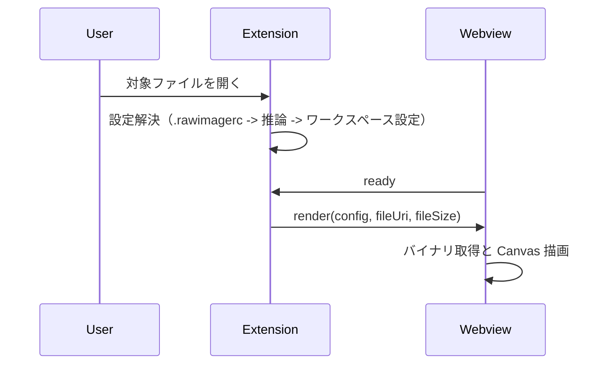

# 詳細設計書: Raw Image Viewer

## 1. 目的と位置づけ

本書は Raw Image Viewer の詳細設計を定義する。
実装に直接対応する処理フロー、メッセージ仕様、フォーマット仕様、制約、エラーハンドリングを扱う。

基本方針と責務分担は [基本設計](basic-design.md) を参照する。
将来の機能追加計画は [ロードマップ](roadmap.md) を参照する。

## 2. コア機能（現在の実装）

### 2.1 ファイル関連付け

- 対象拡張子: `.raw`, `.bin`, `.data`, `.img`, `.gray`, `.yuv`
- エクスプローラーのコンテキストメニュー Open as Raw Image で任意ファイルを表示可能

### 2.2 設定解決優先順位

レンダリングメタデータ（幅、高さ、ヘッダーサイズ、フォーマット）は以下の順で解決する。

1. `.rawimagerc`（ファイル位置から上位ディレクトリへ探索）
2. ファイル名推論（例: `name_1920x1080_rgb24.raw`）
3. ワークスペース設定（`rawviewer.defaultWidth` など）

### 2.3 サポートピクセルフォーマット

| カテゴリ   | フォーマット                         | Bytes/Pixel | 備考                      |
| :--------- | :----------------------------------- | :---------- | :------------------------ |
| Grayscale  | `gray8`, `gray16le`, `gray16be`      | 1, 2        | 8/16-bit グレー           |
| RGB/BGR    | `rgb24`, `bgr24`, `rgba32`, `bgra32` | 3, 4        | インターリーブ形式        |
| YUV        | `yuv420p`, `nv12`, `yuyv422`         | 1.5 - 2     | Planar/Semi-planar/Packed |
| Scientific | `float32`, `depth16`                 | 4, 2        | 自動ウィンドウ/レベル     |

### 2.4 提供機能

- Canvas レンダリング
- PNG エクスポート
- `.rawimagerc` 向け JSON スキーマ連携（補完/検証）
- ズーム/パン、Fit-to-screen、ウィンドウ/レベル調整
- ピクセル位置と値の表示

## 3. 処理フロー

### 3.1 ファイルオープン

1. カスタムエディタを起動
2. 設定解決（`.rawimagerc` → 推論 → ワークスペース設定）
3. Webview へ `render` メッセージ送信

### 3.2 初回描画

- Webview 側が `ready` を 250 ms 間隔で繰り返し送信（Extension からの acknowledgement を受け取るまで）
- Extension 側は `ready` 受信後に描画開始し、タイマーをキャンセル
- 300 ms のフォールバックタイマーにより、`ready` 未受信でも `render` を送信
- 5 秒間 `ready` を受信しない場合は警告メッセージを表示

### 3.3 再描画

- 対象ファイルや `.rawimagerc` の更新時に再解決・再描画
- 連続更新は 100 ms デバウンスして反映

### 3.4 PNG 保存

- Webview から `savePng` を送信
- Extension 側で保存ダイアログを開き、PNG データを書き出す

### 3.5 シーケンス図（初回描画）



## 4. メッセージ仕様

### 4.1 Webview → Extension

| type      | 内容                              |
| --------- | --------------------------------- |
| `ready`   | Webview 初期化完了通知            |
| `savePng` | 現在表示中イメージの PNG 保存要求 |

### 4.2 Extension → Webview

| type     | 内容                                   |
| -------- | -------------------------------------- |
| `render` | 描画対象 URI、設定、ファイルサイズ通知 |
| `error`  | エラー内容通知                         |

`render` メッセージのフィールド:

| フィールド     | 型                         | 内容                                                                                 |
| -------------- | -------------------------- | ------------------------------------------------------------------------------------ |
| `config`       | `RawImageConfig` \| `null` | 解決済み設定。設定が見つからない場合は `null`                                        |
| `configSource` | `string` \| `null`         | 設定の取得元（`"rawimagerc"` / `"filename"` / `"settings"` / `"filename+settings"`） |
| `fileUri`      | `string`                   | Webview からアクセス可能な VS Code Webview URI                                       |
| `fileSize`     | `number`                   | ファイルサイズ（バイト）                                                             |

## 5. 設定仕様

### 5.1 `.rawimagerc`

```json
{
  "patterns": {
    "*": {
      "width": 640,
      "height": 480,
      "format": "rgb24"
    },
    "**/thumbnails/*.bin": {
      "width": 128,
      "height": 128
    }
  }
}
```

トップレベルに `patterns` オブジェクトが必須。キーはグロブパターン（`.editorconfig` 方式）、値はそのパターンに一致するファイルへの設定。複数パターンが一致した場合は後勝ちでマージされる。

グロブ仕様:

- `*` — パスセパレータを含まない任意の文字列（単一セグメント）
- `**` — 任意の文字列（パスセパレータ含む）
- `**/` — 先頭の任意のパスプレフィックス（ゼロ個以上のセグメント）。`**/foo` は `foo` にも `a/b/foo` にもマッチする

各パターン値の項目:

| 項目         | 必須 | 説明                                          |
| ------------ | ---- | --------------------------------------------- |
| `width`      | ○    | 画像の横幅（ピクセル）                        |
| `height`     | ○    | 画像の縦幅（ピクセル）                        |
| `headerSize` | —    | 先頭スキップバイト数（デフォルト: `0`）       |
| `format`     | —    | ピクセルフォーマット（デフォルト: `"rgb24"`） |

`width` と `height` はいずれかのパターンで解決されなければならない。解決できない場合はエラーを Webview に通知する。

`rawviewer.createConfig` コマンドを使うと、テンプレート入りの `.rawimagerc` を生成してエディタで開ける。

### 5.2 ワークスペース設定

- `rawviewer.defaultWidth`
- `rawviewer.defaultHeight`
- `rawviewer.defaultHeaderSize`
- `rawviewer.defaultFormat`
- `rawviewer.inferFromFilename`

## 6. 制約

- `yuv420p` と `nv12` は幅・高さが偶数である必要がある
- `yuyv422` は幅が偶数である必要がある
- Webview スクリプトは nonce 付き CSP 下で実行する
- Webview の参照ルート (`localResourceRoots`) は、セキュリティのため以下のディレクトリに制限される。
  - 表示中のファイルが存在するディレクトリ
  - `.rawimagerc` が別の親ディレクトリで見つかった場合は、そのディレクトリ
- Webview 内の `fetch()` は VS Code の Webview URI スキームを使用してファイルを読み込む。

## 7. エラーハンドリング

異常系はメッセージとして Webview に通知する。

- `.rawimagerc` の JSON 解析失敗
- 必須項目不足
- 不正フォーマット指定
- ファイル保存 I/O エラー
